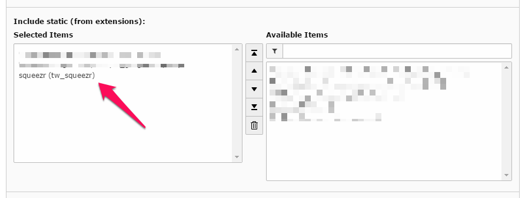
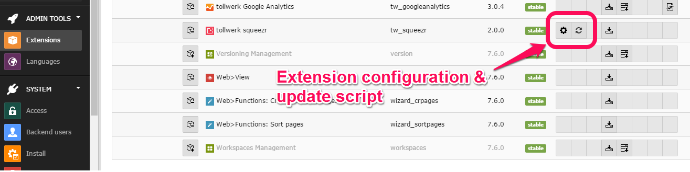
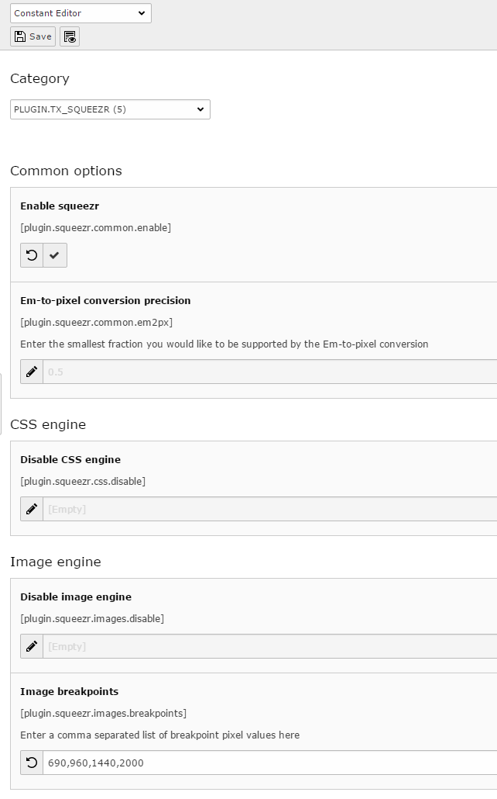
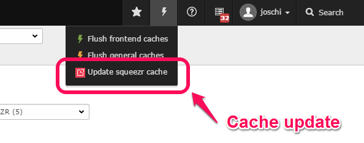

EXT: tollwerk squeezr
=====================

Extension Key: tw_squeezr
Language: en
Version: 1.5.0
Keywords: squeezr, device-aware adaptive images, server side css3 media queries, bandwidth, forAdministrators, forDevelopers, forIntermediates, forAdvanced
Copyright © 2017 Dipl.-Ing. Joschi Kuphal, <joschi@kuphal.net>

This document is published under the Open Content License available from http://www.opencontent.org/opl.shtml

The content of this document is related to TYPO3 — a GNU/GPL CMS/Framework available from www.typo3.org.

For the most recent version of this extension always have a look at the [GitHub repository](https://github.com/tollwerk/TYPO3-ext-squeezr). Please report any issues there as well.

Introduction
------------

###  What does it do?

This extension provides easy means to integrate squeezr into your TYPO3 website. squeezr can help you reducing the size of image and CSS files delivered to your visitors, thus saving them time, bandwidth and nerves.

squeezr currently features two independent engines:

* **Image engine**: squeezr recognizes your visitor's screen size, downscales your images appropriately, caches and finally delivers them to your visitor.
* **CSS engine**: squeezr analyses your CSS files and strips out irrelevant media query sections — on the server side.

Extension features:

* **Easy installation**: Most of the necessary steps are performed automatically or by a single mouse click
* Configuration solely from inside the TYPO3 backend via the extension configuration and the constant editor
* 1-click squeezr cache cleaning from within the backend (useful when image or CSS files are changed)

In order to use the extension, you will have to meet these requirements on your server:

* Apache Webserver 2.2+ (with mod_rewrite)
* PHP 5.3+
* GD (mostly standard with PHP)

The extension was written for TYPO3 version 7+ run in [composer mode](https://wiki.typo3.org/Composer).

For detailed information about squeezr and it's features please visit the squeezr website at [https://squeezr.it](https://squeezr.it). Furthermore, to keep up to date you might want to follow the [@squeezr](https://twitter.com/squeezr) Twitter account or visit the GitHub repository to report any issues.


###  Screenshots

The extension doesn't produce any visible output, so there is nothing to take a screenshot of. Instead, it supports you in reducing the amount of data delivered to your visitors by shrinking your images and CSS files down to the limitations of the visitor's device. Having said this, there might be a visual impact in your specific context though.


Installation
------------

To install the extension add it as a composer dependency to your installation first:

```bash
composer require tollwerk/tw-squeezr
```

Enable it in the TYPO3 Extension Manager run the following steps (**essential!**):

1. Refine / re-save the extension configuration
2. Use the extension's update script

**IMPORTANT**: The update script has to be run each time you update the extension configuration as there are some files that have to be written to disk / copied at certain locations for squeezr to properly work!

### Static TypoScript

Include the extension's static TypoScript into the root template of your site.




Configuration
-------------

### Extension configuration

Start by configuring the engine settings in the extension manager:



Most of the available options correspond to a squeezr configuration constant, which you can also find  on the [squeezr Website](https://squeezr.it):

|Property|Data type|Description|Default|
|--------|---------|-----------|-------|
|`common.lifetime`|integer|By default, squeezr instructs client browsers to cache any file for one week (604800 seconds). You can change this by providing another expiration period here. [`SQUEEZR_CACHE_LIFETIME`]|`604800`|
|`images.images`|`boolean`|Set this to `FALSE` to disable the image engine temporarily. To disable it permanently (and prevent PHP from being involved), just remove or comment out the corresponding image rewrite rules from the main .htaccess file. [`SQUEEZR_IMAGE`]|`1`|
|`images.quality`|`integer`|Control the quality of JPEG images with this setting. You may specifiy an integer between 1 and 100 (reasonable values are 60 - 80; defaults to 80). [`SQUEEZR_IMAGE_JPEG_QUALITY`]|`80`|
|`images.sharpen`|`boolean`|When images are downscaled, they tend to become somewhat blurry. This is why they get slightly sharpened by default. Set this option to FALSE to disable the sharpening. [`SQUEEZR_IMAGE_SHARPEN]`|`1`|
|`images.forcesharpen`|`boolean`|In some situations image sharpening is suspended by default (e.g. when downscaling 8-bit PNG images), as sharpening can seriously affect image quality in these cases. Use this option to forcibly activate sharpening regardless of losses.|`0`|
|`images.undersized`|`boolean`|Sometimes images don't need to be downscaled for a specific breakpoint as they are already small enough by default. Nevertheless, squeezr creates breakpoint specific symlinks in such cases in order to speed up subsequent requests for the same files. If your system doesn't support symlinks for some reason (e.g. due to PHP restrictions), you can still let squeezr create real copies of those files. Set this option to `TRUE` to enable this behaviour, but please be aware of the potentially higher disk space requirements. [`SQUEEZR_IMAGE_COPY_UNDERSIZED`]|`0`|
|`images.pngquantizer`|options|When downscaling 8-bit PNG images, they have to be re-quantized. squeezr comes with an internal quantizer (based on GD), but the results aren't that good. If available, you may use an external quantizer tool like pngquant or pngnq, which has to be installed on the server independently from squeezr (it's up to you to do so). Currently external quantizers are supported on Linux boxes only. Please make sure the quantizer binary you choose is available in your system's `PATH` (i.e. can be called from anywhere on the command line without specifying the binary's directory path).|internal|
|`images.pngquantizerspeed`|`boolean`|If an external quantizer for PNG images is used (see above), you can — within certain limits — control the processing speed respectively the quality of the resulting images (depending on the quantizer in use). Give a positive integer value here, 1 meaning "best qualtity, but slow" and 10 meaning "fast, but rough". Please be aware that using an external quantizer might lead to rather long processing times, but also results in much better quality. However, this should only affect the very first request of a particular image for a particular breakpoint, as follow-up requests will get served from out of the cache. It's up to you if you expect your visitors to pay this price.|`5`|
|`css.css`|`boolean`|Set this to `FALSE` to disable the css engine temporarily. As with the image engine, to disable it permanently (and prevent PHP from being involved), just remove or comment out the corresponding CSS rewrite rules from the main .htaccess file. [`SQUEEZR_CSS`]|`1`|
|`css.minfy`|`boolean`|Whether or not to apply CSS minification to the output CSS. [`SQUEEZR_CSS_MINIFY`]|`1`|

After having modified any of these extension settings, it is essential that the changes are written to disk. So any time you alter some values here — also after the initial configuration — be sure to use the extension's update script in order to write out the new configuration. squeezr will not work otherwise!


Constants
---------

There are a couple of constants controlling the frontend behaviour of squeezr. Edit them using the constant editor:



|Property|Data type|Description|Default|
|--------|---------|-----------|-------|
|`common.enable`|`boolean`|You need to check this option in order to make squeezr work. If you don't, squeezr's JavaScript will not be integrated into your frontend output and none of the necessary cookies will be sent to the server. Use this as a general on/off switch for squeezr.|`0`|
|`common.em2px`|`float`|When the squeezr script measures the em-to-pixel ratio of a visitor's screen, it does so by employing a certain precision, which defaults to a value of 0.5. Therefore, squeezr measures in steps like 10em, 10.5em and 11em by default. You can alter this precision by specifying an arbitrary positive floating point value like 0.01, which means that squeezr will be as precise as 10.00em, 10.01em and 10.02em.|`0.5`|
|`css.disable`|`boolean`|If set, the CSS engine is disabled altogether. You don't need to take care of the em-to-pixel ratio in this case either.|`0`|
|`images.disable`|`boolean`|If set, the image engine is disabled altogether. You don't need to specify the image breakpoints in this case either.|`0`|
|`images.breakpoints`|`string`|If you want to use the image engine, this attribute has to be present and must carry a comma separated list of breakpoints to be used. The breakpoints have to be expressed in pixels. If this option is empty, the image engine will stay inactive.|`""`|

[tsref:plugin.squeezr]


Setup
-----

### TypoScript

This extension doesn't have any TypoScript options that need to be configured. As soon as you have installed and configured the extension, included the static TypoScript into your root template and configured the available constants, squeezr is almost operational. Just don't forget to incorporate the necessary Apache rewrite rules as a last step.

### Apache rewrite rules

You will have to install some Apache rewrite rules in order to make squeezr work. Depending on whether you already have a **`.htaccess` file** on the top level of your website, you may use the default one shipping with squeezr, or you will have to manually craft the necessary rules into your existing one.

#### A) Start a new `.htaccess` file
In case you don't have a top level `.htaccess` file yet, just copy squeezr's default one from `vendor/jkphl/squeezr/.htaccess` to your website root directory. As the extension pulls in a vanilla distribution of squeezr, there's a little tweak that you should apply in order to exclude the TYPO3 backend from being processed by squeezr as well. Simply put another rewrite condition into **both the rewrite rules for images and CSS files**, just before the lines starting with `RewriteRule` (see below for a complete example):

```
RewriteCond %{REQUEST_URI} !^/typo3/
```

That's it. squeezr should be able to run with this setup now.

#### B) Incorporating the rewrite rules into an existing `.htaccess` file

In case you already have a .htaccess file for your site, please open it using a text editor. Find out if there's already a rewrite rule section (which is likely if you're using e.g. cooluri or RealURL). It might e.g. look like this:

```
<IfModule mod_rewrite.c>
	RewriteEngine On
	RewriteBase /

	# HERE COME SOME REWRITE RULES
	# ...
</IfModule>
```

If there's no such section yet, then you might use the above as a template (or better get it from squeezr's `.htaccess` file, see above). Then copy the rewrite rules from squeezr's default `.htaccess` file (`vendor/jkphl/squeezr/.htaccess`) into this section and apply the TYPO3 backend tweak (already included in the following example; see above for a description):

```
#############################################################################################################
# REDIRECT ANY DIRECT IMAGE REQUEST TO A CACHED VERSION
#
# You may add files or directories that shouldn't be touched by squeezr like this:
#
#    RewriteCond %{REQUEST_URI} !path/to/some/file-or-directory
#
# Please refer to the mod_rewrite documentation at http://httpd.apache.org/docs/2.2/mod/mod_rewrite.html for
# further possibilities and instructions.
# ~~~~~~~~~~~~~~~~~~~~~~~~~~~~~~~~~~~~~~~~~~~~~~~~~~~~~~~~~~~~~~~~~~~~~~~~~~~~~~~~~~~~~~~~~~~~~~~~~~~~~~~~~~~
    RewriteCond %{REQUEST_FILENAME} -f
    RewriteCond %{ENV:REDIRECT_BREAKPOINT} !\d+px
    RewriteCond %{QUERY_STRING} !^([^&]*&)*squeezr=(0|false|no)
    RewriteCond %{HTTP_COOKIE} squeezr.images=(\d+px) [NC]
    RewriteCond %{REQUEST_URI} !^/typo3/
    RewriteRule ^(.+)(\.(?:jpe?g|gif|png))$ squeezr/cache/$1-%1$2 [NC,E=BREAKPOINT:%1,L]
# ~~~~~~~~~~~~~~~~~~~~~~~~~~~~~~~~~~~~~~~~~~       ~~~~~~~~~~~~~~~~~~~~~~~~~~~~~~~~~~~~~~~~~~~~~~~~~~~~~~~~~~
# Please make sure that you set this path     ^^^     to the squeezr root directory that is also specified
# for the SQUEEZR_ROOT constant in the common engine configuration (SQUEEZR_ROOT/conf/common.php). If you
# apply the default setup for squeezr (i.e. put everything into a directory named "squeezr" under your
# website's document root), then you shouldn't have to change anything.
#############################################################################################################


#############################################################################################################
# REDIRECT ANY DIRECT CSS REQUEST TO A CACHED VERSION
#
# See above for some hints about excluding files or directories from the squeezr processing
# ~~~~~~~~~~~~~~~~~~~~~~~~~~~~~~~~~~~~~~~~~~~~~~~~~~~~~~~~~~~~~~~~~~~~~~~~~~~~~~~~~~~~~~~~~~~~~~~~~~~~~~~~~~~
    RewriteCond %{REQUEST_FILENAME} -f
    RewriteCond %{ENV:REDIRECT_BREAKPOINT} !\d+px
    RewriteCond %{QUERY_STRING} !^([^&]*&)*squeezr=(0|false|no)
    RewriteCond %{HTTP_COOKIE} squeezr.css=(\d+x\d+@\d+(?:\.\d+)?) [NC]
    RewriteCond %{REQUEST_URI} !^/typo3/
    RewriteRule ^(.+)\.css$ squeezr/cache/$1-%1.css [NC,E=BREAKPOINT:%1,L]
# ~~~~~~~~~~~~~~~~~~~~~~~~~~       ~~~~~~~~~~~~~~~~~~~~~~~~~~~~~~~~~~~~~~~~~~~~~~~~~~~~~~~~~~~~~~~~~~~~~~~~~~
# See above for hints on      ^^^     this path.
#############################################################################################################
```

#### Symbolic links

Finally, make sure that your `.htaccess` file contains

```
Options +FollowSymlinks
```

somewhere. This is necessary for Apache to follow symlinks, which is an essential requirement for squeezr.

There is some more useful stuff at the end of squeezr's default `.htaccess` file. These parts are not mandatory, but you may want to use them as well as they could lead to a significantly improved performance of your website.

Please see the [official mod_rewrite documentation](http://httpd.apache.org/docs/current/mod/mod_rewrite.html) on further instructions on rewrite rules in general.


Features
--------

### Cache cleaning from the backend

When squeezr downscales images or shrinks CSS files by stripping out irrelevant media query sections, it generates file variants and caches them to disk. However, when you alter the original images or CSS files afterwards, the generated variants will likely get outdated. In order to keep file requests for your visitors as efficient as possible, squeezr does not impose an automatic cache validity check at request time. Instead, it's the editor's (that is: your) obligation to explicitly clean the cache each time you want some changes to become effective. Therefore, the extension introduces a new option as part of the cache operations dropdown which you can use for manually cleaning / regenerating squeezr's cache. Both cached images and CSS files are affected and will be deleted if the original file has a newer modification date.



### Cleaning the cache on the command line

Starting with version 1.0.0, squeezr also offers a command line interface (CLI) for cleaning the cache. You can for example use it for periodically checking the cache validity with the help of a cronjob. The squeezr CLI hooks into the standard TYPO3 CLI and is to be invoked like this (please adapt the paths to your system):

```
php -f /path/to/your/siteroot/typo3/cli_dispatch.phpsh squeezr clear
```

The effect will be the same as if you had cleaned the cache from within the backend by using the cache operations dropdown option (see above).

As for all CLI scripts, you will be required to create a backend user called _cli_squeezr on the root level of your page tree. The user should not carry any privileges and have a very, very complicated password. No one will ever use this account to log into TYPO3, it's just needed for the CLI operations.

### Manually cleaning the cache

It's also safe to clean the cache manually by removing the cached images and CSS files (inside the directory `/squeezr/cache`) directly via the file system or FTP.

However, please be aware of the following pitfall: squeezr makes intensive use of symbolic links ("symlinks"). When deleting a list of resources, it may happen that an original file is deleted before a symlink to this very file (depending on the deletion order), thus invalidating the symlink. This may happen with squeezr's CSS file cache in particular. Some file system explorers / FTP clients (like e.g. Zend Studio) tend to hide invalid symlinks, so that you will not see them anymore and thus will not be able to delete them. As a consequence, this might also prevent squeezr from restoring the CSS cache files upon the next request, as the Apache webserver will see the symlink (but not check it for validity) and think that there's no need to employ squeezr. Please use the backend cache cleaning feature (see above) or a file system explorer capable of displaying invalid symlinks in such cases.


Known problems
--------------

There are no known problems specific to the TYPO3 extension. However, squeezr itself has some aspects you might want to know. Please report any problems [to the author](https://github.com/jkphl).

For detailed information about squeezr, it's features and also it's limitations please visit the squeezr website at [https://squeezr.it](https://squeezr.it). Furthermore, to keep up to date you might want to follow the @squeezr Twitter account or visit the GitHub repository to report any issues.


To-Do list
----------

Currently there are no particular plans for the future except keeping pace with the improvements of squeezr itself. If there's something you would like to see in this extension then please [let me know](https://github.com/jkphl)!


ChangeLog
---------
Please see the [changelog](https://github.com/tollwerk/TYPO3-ext-squeezr/blob/master/CHANGELOG.md) for details.


